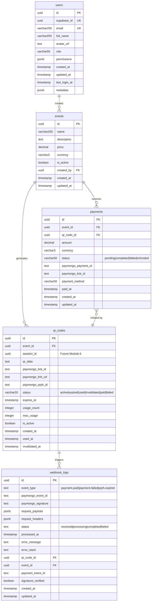

## Payment System Database Schema

### Entity Relationship Diagram


### Table Relationships

1. **users → events**
   - One-to-many: A user can create multiple events
   - Foreign key: `events.created_by` → `users.id`

2. **events → qr_codes**
   - One-to-many: An event can have multiple QR codes
   - Foreign key: `qr_codes.event_id` → `events.id`
   - Cascade delete: QR codes are deleted when event is deleted

3. **events → payments**
   - One-to-many: An event can receive multiple payments
   - Foreign key: `payments.event_id` → `events.id`
   - Cascade delete: Payments are deleted when event is deleted

4. **qr_codes → webhook_logs**
   - One-to-many: A QR code can trigger multiple webhook events
   - Foreign key: `webhook_logs.qr_code_id` → `qr_codes.id`
   - Nullable: Webhook might not always reference a QR code

5. **payments → qr_codes**
   - Many-to-one: A payment is initiated by one QR code
   - Foreign key: `payments.qr_code_id` → `qr_codes.id`
   - Required: Every payment must reference a QR code

### Status Flows

1. **QR Code Status**
   ```
   active → paid/failed/expired/invalidated
   ```
   - `active`: Initial state, QR is valid and can be used
   - `paid`: Payment completed successfully
   - `failed`: Payment attempt failed
   - `expired`: Past `expiresAt` timestamp
   - `invalidated`: Manually cancelled or new QR generated
   - `used`: Set by reconciliation (consider standardizing on `paid`)

2. **Payment Status**
   ```
   pending → completed/failed → refunded (optional)
   ```
   - `pending`: Payment initiated but not completed
   - `completed`: Payment successfully processed
   - `failed`: Payment processing failed
   - `refunded`: Payment was refunded (post-completion)

3. **Webhook Log Status**
   ```
   received → processing → completed/failed
   ```
   - `received`: Webhook event received, signature verified
   - `processing`: Event being handled
   - `completed`: Successfully processed
   - `failed`: Processing failed with error