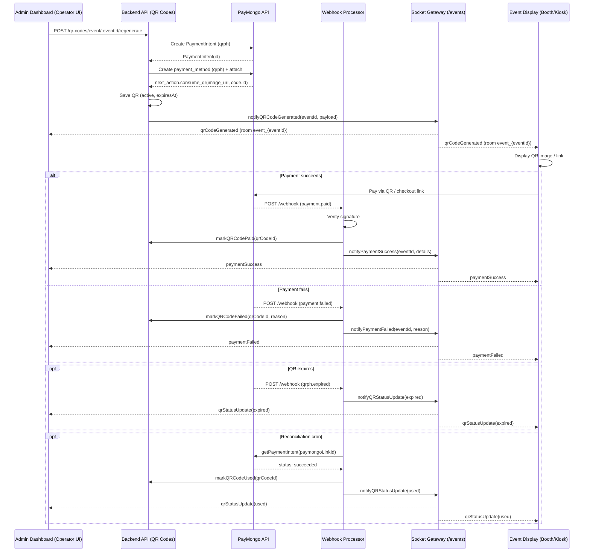

## QR Code → PayMongo → Webhook → Realtime Flow

### Purpose
- Provide a concise, end-to-end overview of how QR codes are created via PayMongo, how payment updates are received, and how realtime notifications are emitted to clients.

### Modules Overview
- **QR Codes**: [qr-codes.service.ts](mdc:apps/backend/src/qr-codes/qr-codes.service.ts), [qr-codes.controller.ts](mdc:apps/backend/src/qr-codes/qr-codes.controller.ts)
- **PayMongo**: [paymongo.service.ts](mdc:apps/backend/src/paymongo/paymongo.service.ts)
- **Webhooks**: [webhooks.controller.ts](mdc:apps/backend/src/webhooks/webhooks.controller.ts), [webhooks.service.ts](mdc:apps/backend/src/webhooks/webhooks.service.ts), [webhook-reconciliation.service.ts](mdc:apps/backend/src/webhooks/webhook-reconciliation.service.ts)
- **Realtime**: [events.gateway.ts](mdc:apps/backend/src/realtime/events.gateway.ts), [realtime.service.ts](mdc:apps/backend/src/realtime/realtime.service.ts)

### High-Level Flow
1. Client (operator UI) requests a new QR for an event.
2. Backend creates a PayMongo PaymentIntent (QRPh) and attaches a `qrph` payment method to get a QR image.
3. Backend saves QR record, broadcasts `qrCodeGenerated` to the event room, returns data via REST.
4. Payer scans QR (or uses generated payment link) and completes payment.
5. PayMongo calls our webhook with `payment.paid` / `payment.failed` / `qrph.expired`.
6. Webhook handler resolves the QR record, updates status in DB, logs event, and emits realtime updates (`paymentSuccess`, `paymentFailed`, `qrStatusUpdate`).
7. Cron jobs handle expiry warnings, mark expired QRs, and reconcile any missed webhook payments.

### Sequence Diagram


### REST Endpoints
- `GET /qr-codes/event/:eventId/current`
  - Returns the latest active QR (if valid and not expired) for the event (auth via Supabase JWT).
- `POST /qr-codes/event/:eventId/regenerate`
  - Generates a new QR; cancels or archives any existing active QRs for that event.
- `GET /qr-codes/event/:eventId/history`
  - Returns historical QR records for the event.
- `GET /qr-codes/:qrCodeId/status`
  - Returns status and time-to-expiry for a specific QR.
- `GET /qr-codes/:qrCodeId/payment-link`
  - Convenience endpoint exposing `checkoutUrl` from PayMongo for web testing.
- `GET /qr-codes/:qrCodeId/image`
  - Returns base64 JSON or PNG image (based on `Accept`) of the QR image stored.
- `POST /webhook`
  - PayMongo webhook receiver; responds immediately; processes asynchronously.

### Realtime (Socket.IO)
- Namespace: `/events` (CORS: `CORS_ORIGIN` or `http://localhost:4200`).
- Auth: token required in handshake (`auth.token` or `Authorization: Bearer ...`).
- Rooms: `joinEvent`/`leaveEvent` with `{ eventId }` join/leave `event_{eventId}`.
- Emitted Events and Payloads:
  - `qrCodeGenerated`: `{ qrCodeId, eventId, checkoutUrl, qrCodeImage, expiresAt, amount, currency }`
  - `qrStatusUpdate`: `{ qrCodeId, eventId, status: 'active'|'expired'|'used'|'invalidated'|'paid'|'failed', expiresAt?, timeUntilExpiry?, failureReason? }`
  - `qrExpiryWarning`: `{ qrCodeId, eventId, minutesRemaining, message }`
  - `paymentSuccess`: `{ qrCodeId, eventId, paymentId, amount, currency }`
  - `paymentFailed`: `{ qrCodeId, eventId, paymentId, failureReason }`

### Data Persisted (QR record)
Fields set or referenced in code (see service/controller):
- `id`, `eventId`
- `qrData` (base64 PNG from PayMongo `image_url` or locally generated fallback)
- `paymongoLinkId` (PaymentIntent id `pi_...`)
- `paymongoLinkUrl` (Payment Link `checkout_url`)
- `paymongoQrphId` (from `next_action.code.id` or payment method id)
- `status`: `active | paid | failed | expired | invalidated | used`
- `expiresAt`, `isActive`, `usageCount`, `maxUsage`, `usedAt`, `invalidatedAt`
- `createdAt`, `updatedAt`

### PayMongo Integration
- PaymentIntent (QRPh): `createPaymentIntentWithQR` with `payment_method_allowed: ['qrph']`.
- Attach `qrph` payment method: `createAndAttachQRPaymentMethod` → `next_action.consume_qr.code.image_url` and `code.id` (kept as `paymongoQrphId`).
- Payment Link: `createPaymentLink` for a browser-based fallback/testing flow.
- Other ops: `getPaymentIntent`, `cancelPaymentIntent`, `archivePaymentLink`, `createStaticQRCode`.

### Webhook Handling
- Signature (`paymongo-signature`) parsed as `t=..., te=..., li=...`; HMAC-SHA256 computed over `"${timestamp}.${payloadJson}"` with `PAYMONGO_WEBHOOK_SECRET`.
- Accepted event types:
  - `payment.paid` → resolve QR via `payment_intent_id` → `markQRCodePaid` → broadcast and log.
  - `payment.failed` → `markQRCodeFailed` with failure message → broadcast and log.
  - `qrph.expired` → resolve QR via `paymongoQrphId` → broadcast `expired` and log.
- Webhook processing is queued asynchronously after immediate 200 response.

### Scheduled Jobs
- QR cleanup (node-cron in QR Codes service):
  - Every 5 min: mark active but past-expiry as `expired`; emit `qrExpiryWarning` when within 5 min of expiry.
- Reconciliation (Nest Schedule in Webhooks):
  - Every 5 min: for active QRs older than 2 min, fetch PaymentIntent; if `status === 'succeeded'` but not updated, mark as used and log; also marks expired if past `expiresAt`.

### Configuration
- `PAYMONGO_SECRET_KEY` (required)
- `PAYMONGO_WEBHOOK_SECRET` (required for signature verification)
- `CORS_ORIGIN` (optional; WS CORS)

### Client Integration (Quick Start)
- Connect WS with token:
```ts
import { io } from 'socket.io-client';
const socket = io('/events', { auth: { token: '<JWT or session token>' } });
```
- Join event room and listen:
```ts
socket.emit('joinEvent', { eventId });
socket.on('qrCodeGenerated', data => { /* show QR */ });
socket.on('qrStatusUpdate', data => { /* update UI */ });
socket.on('paymentSuccess', data => { /* success */ });
socket.on('paymentFailed', data => { /* failure */ });
```
- REST helpers:
```bash
# Generate new QR (server-side user context required)
curl -X POST -H "Authorization: Bearer <JWT>" \
  http://<host>/qr-codes/event/<eventId>/regenerate

# Get current QR
curl -H "Authorization: Bearer <JWT>" \
  http://<host>/qr-codes/event/<eventId>/current

# Retrieve QR image (JSON with base64)
curl -H "Accept: application/json" \
  http://<host>/qr-codes/<qrCodeId>/image
```

### Operational Notes
- Newly generating a QR invalidates existing active ones for the event (cancels PI or archives Link, then DB set to `invalidated`).
- If PayMongo does not return a QR `image_url`, a fallback QR is generated locally (for demo/testing; not a real bank-app QR).
- WebSocket handshake stores the provided token but does not validate it here—consider adding validation in gateway or via guard.

### Known Gaps / Follow-ups
- Status consistency: webhook marks `paid`, reconciliation marks `used`. Consider standardizing on `paid`.
- Scheduling: mix of `node-cron` (QR cleanup) and Nest `@nestjs/schedule` (reconciliation). Consider standardizing on Nest Schedule.
- Strengthen WS auth (verify token, limit room joins to authorized users for `eventId`).
